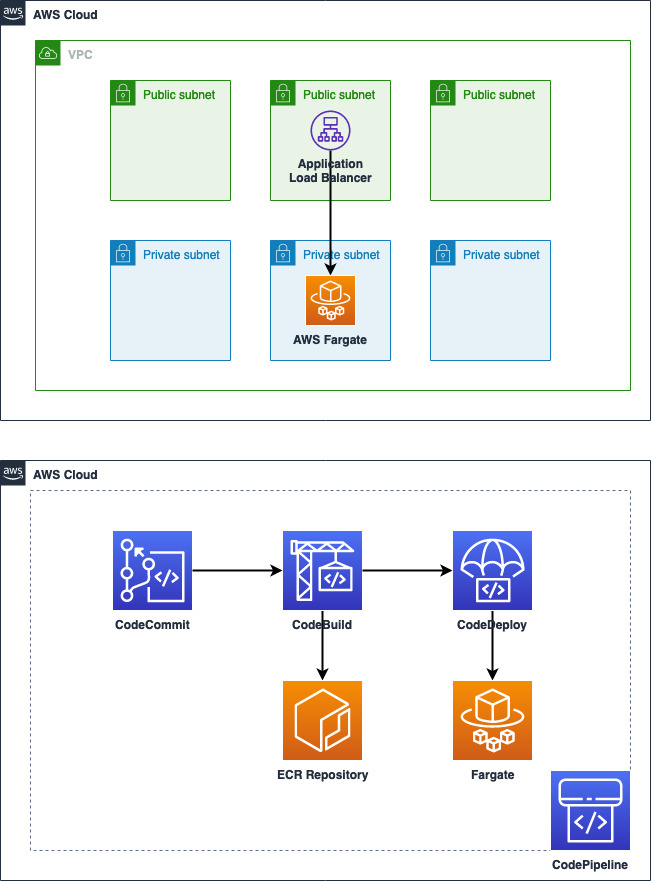

# ECS blue/ green deployment using CDK

A walkthrough for this example can be found at https://ecsworkshop.com/blue_green_deployments/

#### Table of Contents

* [Outcome](#Outcome)
* [What are we building?](#what-are-we-building)
* [Why do I need this?](#why-do-i-need-this)
* [What are the pre-requisites?](#what-are-the-pre-requisites)
* [How can I deploy the stack?](#how-can-i-deploy-the-stack)
* [Cleanup](#cleanup)
* [Security](#security)
* [License](#license)

## Outcome

ECS blue/ green deployment CDK construct enabling teams to build and deploy pipeline for their workloads.

## What are we building?

* CodePipeline will be used for executing Blue/Green deployment using CodeCommit, CodeBuild and CodeDeploy
* The container images will be stored in the Elastic Container Registry
* NGINX sample application is deployed in AWS Fargate
* The construct uses a custom resource for creating the deployment configuration and builds the end-to-end infrastructure



## Why do I need this?

* With a blue/green deployment, you provision a new set of containers on which CodeDeploy installs the latest version of your application. CodeDeploy then re-routes load balancer traffic from an existing set of containers running the previous version of your application to the new set of containers running the latest version
* Blue/green deployments allow you to test the new application version before sending production traffic to it without disrupting the existing environment
* If there is an issue with the newly deployed application version, you can roll back to the previous version faster than with in-place deployments
* Switching to the green environment involves no downtime. It only requires the redirecting of user traffic
* Rolling back from the green environment to the blue environment in the event of a problem is easier because you can redirect traffic to the blue environment without having to rebuild it
* You can incorporate the principle of infrastructure immutability by provisioning fresh instances when you need to make changes. In this way, you avoid configuration drift.

## What are the pre-requisites?

```
brew install jq
npm install -g -f aws-cdk@2.50.0
cd $HOME && mkdir -p environment && cd environment
git clone https://github.com/aws-containers/ecs-workshop-blue-green-deployments.git
cd $HOME/environment/ecs-workshop-blue-green-deployments
```
* You have configured AWS CLI using `aws configure`
* You have the set the `AWS_REGION` within `aws configure`
* The role being used from CLI has the permissions required for resources being created by CDK
* HTTPS (GRC) is the protocol to use with `git-remote-codecommit` (GRC). This utility provides a simple method for pushing and pulling code from CodeCommit repositories by extending Git. It is the recommended method for supporting connections made with federated access, identity providers, and temporary credentials
* Install `git-remote-codecommit` with `pip install git-remote-codecommit`

## How can I deploy the stack?

* Install dependencies and build
    ```shell
    npm install
    npm run build
    npm run test
    ```
* Deploy the CodeCommit and CodeBuild resources
    ```shell
    cd $HOME/environment/ecs-workshop-blue-green-deployments
    ./bin/scripts/deploy-container-image-stack.sh
    ```
* Push the source code to CodeCommit
  * The source code is available [here](nginx-sample/README.md)
  * The [buildspec.yml](nginx-sample/buildspec.yml) has placeholders for the variables
    ```shell
    export AWS_DEFAULT_REGION=$(aws configure get region)
    export CODE_REPO_NAME=nginx-sample
    export CODE_REPO_URL=codecommit::$AWS_DEFAULT_REGION://$CODE_REPO_NAME
    cd $HOME/environment && git clone $CODE_REPO_URL && cd $CODE_REPO_NAME
    cp $HOME/environment/ecs-workshop-blue-green-deployments/nginx-sample/* .
    git checkout -b main
    git remote -v
    git add .
    git commit -m "First commit"
    git push --set-upstream origin main
    ```
* Deploy the CodePipeline resources
    ```shell
    cd $HOME/environment/ecs-workshop-blue-green-deployments
    ./bin/scripts/deploy-pipeline-stack.sh
    ```

## Cleanup

```shell
cd $HOME/environment/ecs-workshop-blue-green-deployments
./bin/scripts/destroy.sh
```

# Security

See [CONTRIBUTING](CONTRIBUTING.md#security-issue-notifications) for more information.

# License

This library is licensed under the MIT-0 License. See the [LICENSE](LICENSE) file.
